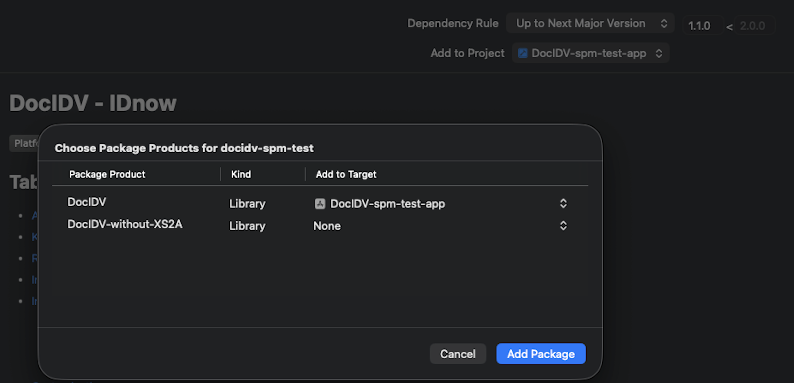

# DocIDV - IDnow

[](https://developer.apple.com/ios/)
[](https://developer.apple.com/swift/)
[](https://developer.apple.com/swift/)
[](https://img.shields.io/badge/Swift_Package_Manager-compatible-orange)

## Table of Contents

- [About](#about)
- [Key Features](#key-features)
- [Requirements](#requirements)
- [Installation](#installation)
- [Integration](#integration)
    - [Starting the SDK](#starting-the-sdk)
    - [Handle Result](#handle-result)
    - [Error Description](#error-description)
- [Customization](#customization)
- [Additional features](#additional-features)

## About
Welcome to the IDnow DocIDV project. This repository is the official and only way to import and use the DocIDV iOS sdk, it enables you to capture documents with camera through several security checks and other features.
The DocIDV framework incorporates the IDnow platform into iOS apps. We offer 2 SDK variants as xcframeworks with and without the Bank transfer feature.

- DocIDV
- DocIDV-without-XS2A

You will find here details about how to install, setup and work with the SDK.


## Key Features

* **OCR**: Identity documents capture
* **OTP**: Phone number verification
* **Liveness**: Liveness check for a secured flow
* **NFC**: NFC chip scan
* And several more exciting features ! 

## Requirements

* **Xcode:** version 26.1 or higher.
* **Deployment target:** iOS 14.0 or later.
* **Swift:** 5.0
* **NFC:** NFC-enabled smartphone. (iPhone7 or newer models)

## Installation

Follow the next steps to integrate the DocIDV library into your application

### Import SDK

DocIDV sdk is only available through Swift Package Manager (SPM). 
1. Copy the official SPM link [https://github.com/idnow/docidv-sdk-ios](https://github.com/idnow/docidv-sdk-ios)
2. Open your application in Xcode, click on `File` then on `Add Package Dependencies` and paste docidv url.
3. Fill the package version you want, we advice you to add the last major one by selecting "Up to Next Major Version". Click on `Add Package`
4. Add one the 2 Package product to your application target : DocIDV or DocIDV-without-XS2A. Here is the render on Xcode on a sample project :




5. Click on `Add Package`.

📥 DocIDV is now imported into your project.
Note that Xcode has also import several other libraries that we are using. You will find them in the `Package Dependencies` list on left tab.

### Configure your app

To work with our SDK, you need to follow next steps to configure the use of NFC and Camera.

#### Entitlements file

1. Create an entitlements file if you do not have one (Add new file, property list, name it wih this format `my_app.entitlements`).
2. Add an array with the key `Near Field Communication Tag Reader Session Formats`
3. In this array, add an item:
    - key: `Item 0 (Near Field Communication Tag Reading Session Format)`
    - value: `Tag-Specific Data Protocol (TAG)`

#### Info.plist file

1. Open your main Info.plist file
2. Add an array with the key `ISO7816 application identifiers for NFC Tag Reader Session`.
3. Add the following entries to this array:
    - `A00000045645444C2D3031`
    - `A0000002471001`
4. Add an entry for `Privacy - NFC Scan Usage Description` that describes usage of the NFC functionality to the users
5. Add an entry for `Privacy - Camera Usage Description` that describes usage of the camera functionality to the users.
6. Add an entry for `Privacy - Photo Library Usage Description` that describes usage of storing photo on the device.
7. If you use video call feature, please add `Privacy - Microphone Usage Description` that describes usage of microphone in a call with agent.


👏 You have now access to the DocIDV SDK, so let's see how to work with it.

## Integration
### Starting the SDK
Here is an implementation example of launching the SDK from a host app:

```swift
func startDocIDV() {
    IDnowSdk.shared.start(
        token: "YOUR_TOKEN",
        fromViewController: self,
        listener: { [weak self] (result: IDnowSdk.IdentResult.type, statusCode: IDnowSdk.IdentResult.statusCode, message: String) in 
            // Handle result here 
    })
}
```
This code call the main start method to launch the docidv library. It takes several parameters:

| Parameters | Type          | Description |
| ---------- | ------------- | ----------- |
| token      | `String`      | The provided Ident token. |
| isRoutedSession     | `Bool`   | "TODO"|
| preferredLanguage     | `String`   | Host app preferred language code, default is english, "en" value|
| bindingKey     | `String`   | Ysed for device binding use cases. It helps establish a correlation between a user's verified identity and their mobile device. This is particularly useful for device authentication and re-authentication scenarios when users change devices. BindingKey for a completed identification can be fetched via an API endpoint and compared with the one that was used during SDK initialization. |
| fromViewController   | `UIViewController`    | The presenting controller should support modal presentation from it. <br><br>Additionally, it is used to determine the appearance mode from the integrator app by accessing the userInterfaceStyle. |
| listener   | `IDnowSDKResultListener` | Callback used to received the result of the docidv session, throwing a result type and a status code. |

### Handle result

Ensure the SDK start with the callback argument mentioned above, and then handling the result in the listener callback:

```swift
switch result {
    case .ERROR:
        print("Session finished with error with statusCode: \(statusCode) and message: \(message)")
    case .CANCELLED:
        print("Session cancelled with statusCode: \(statusCode) and message: \(message)")
    case .FINISHED:
        print("Session succeeded")
    default:
        break
    }       
```

### Handling Errors
#### All errors code
When the callback is in error, the status code can take these values. Here is the enum with the description of every case.
```swift
public enum statusCode: Int {
    case E10 = 10, // - Default Error
         E100 = 100, // - Token format incorrect (we detect this within the app with the regex)
         E101 = 101, // - Token not found (404 --> get info call)
         E102 = 102, // - Token expired/deleted (410 --> get info call)
         E103 = 103, // - Token already completed (412 --> start call)
         E110 = 110, // - REST call for ident info failed, response problem (not parsable or empty/nil)
         E111 = 111, // - REST call for ident info failed, server problem
         E120 = 120, // - REST call for messages failed, response problem (not parsable or empty/nil)
         E121 = 121, // - REST call for messages failed, server problem
         E130 = 130, // - REST call for resources failed, response problem (not parsable or empty/nil)
         E131 = 131, // - REST call for resources failed, server problem
         E140 = 140, // - REST call for QES name failed, response problem (not parsable or empty/nil)
         E141 = 141, // - REST call for QES name failed, server problem
         E142 = 142, // - REST call for QES name failed, missing fullname
         E150 = 150, // - Start ident failed, response problem (not parsable or empty/nil)
         E151 = 151, // - Start ident failed, server problem
         E152 = 152, // - Start ident failed, missing session key
         E153 = 153, // - Start ident failed, vi token used in AI SDK
         E160 = 160, // - Start ident via WEB failed
         E170 = 170, // - Backend forced close websocket connection
         E171 = 171, // - Backend command PROCESS_FAILED via websocket
         EUnreachable = 1000 // - Unreachbale
}
```
#### How to work with specific error
For `E102` it is recommended to create another ident and restart the process with the new ident code.

For `E103` it is recommended to show a screen to the user with the message that they have submitted all info needed and that they should wait for the final result.

For `E170` it is recommended to notify the user that the ident process timed out or was started on a different device and ask them to try again.

For all other error codes it is recommended to show a generic error for the user and ask them to try again by restarting the process.

🎉 And here is it, DocIDV can now be launched from your host app.

## Additional features 
### Dark mode
Each screen of the IDnowEID SDK natively supports the dark mode according to your app’s setting. It automatically adjusts for the custom appearance using the default theme set on our side.

### Localization
The SDK supports several languages (ISO 639-1). Find bellow the list: 

English, Arabic, Bulgarian, Czech, Danish, German, Spanish, Estonian, Finish, French, Gujarati, Croatian, Hungarian, Italian, Dutch, Punjabi, Polish, Portuguese, Romanian, Russian, Slovak, Serbian, Swedish, Turkish, Ukrainian.